<p align="center">
    
</p>

**Y**et **A**nother **W**allpaper **M**anager, a simple and minimalist wallpaper manager for Linux and Windows (*MacOS coming soon*).

# Table of contents
- [Installation](#installation)
- [How to use](#how-to-use)
    - [Getting started](#getting-started)
    - [What are Thumbnails and Preview Images](#what-are-thumbnails-and-preview-images)
    - [Adding new wallpapers](#adding-new-wallpapers)
    - [Other minor features of the app](#other-minor-features-of-the-app)
- [Reporting issues](#reporting-issues)
- [Contributing](#contributing)
- [Final thoughts](#final-thoughts)

## Installation
At the mooment of writing this readme file (*08/23/2025*), the **1.1 version** is available for **Windows** and **Linux** for the **x86** (*32 and 64 bits*) and the 
**arm** architectures. To download the app, you can head over to [Releases](https://github.com/m0xn/yawm/releases), where you'll find executable files
for each one of the binaries mentioned earlier (*The format for Linux is `yawm_linux.<architecture>` and for Windows `yawm_windows.<architecture>.exe`):
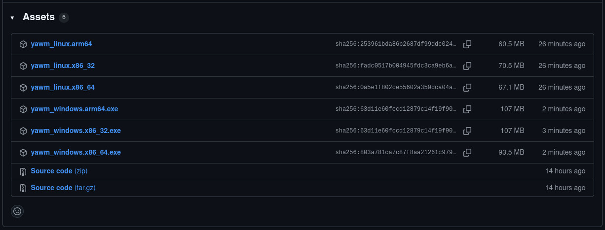
Then, saving your desired binary to your computer is as easy as clicking on the file you want to download.
Finally, you can move the executable wherever you want and **start using the program**.

> [!WARNING]
> Right now, Windows recognizes this app as *untrusted* showing the user the "Windows protected your PC" popup the first time you open the app. There's
> nothing to worry about, **it is not malware**. I'll be sending the app for **malware analysis** to see if I can get rid of it, but for now, you can
> just click on **More info** and then on the **Run anyway** button.

> [!NOTE]
> Linux users will need to grant the program **execute permissions** using the `chmod` command:
> ```
> chmod +x yawm_linux.<architecture>
> ```

## How to use
### Getting started
The first time opening the app, you'll be greated with a **Welcome window** explaining that you'll need to setup some **settings** in order to
start using the app. Clicking on the **Start** button will show you the following window:
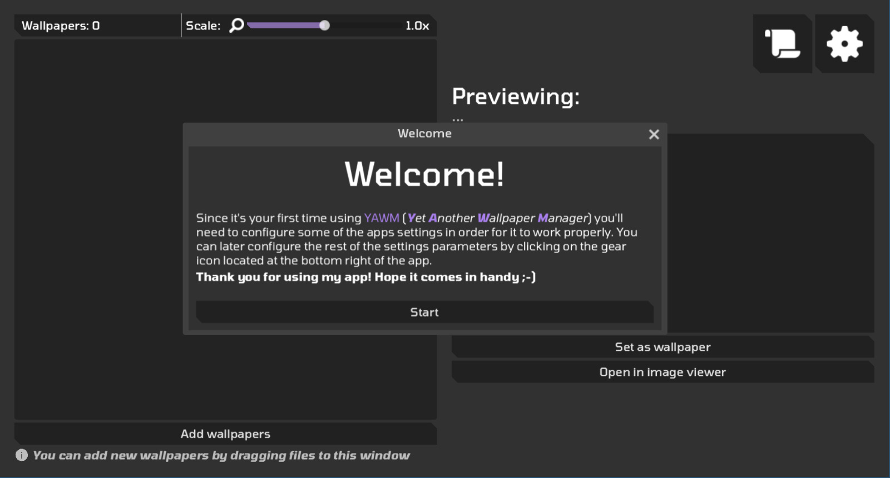
In the first settings section you can change the **Folder for wallpapers** which will be the **main folder** used by the program to **store** and **read**
your wallpapers. A system folder is created by default (`user://wps_dir`) which is located at the **App data** directory on your system (*`%appdata%` on
Windows, `~/.local/share` on Linux*). However, if you'd like to add your **own wallpapers folder**, you can do so by **typing** its path in the **text field**
or by searching for it in the file explorer that will popup after clikcking the  button. If there are
any **valid wallpapers** (*i.e. PNG and JPG,JPEG files*) the app will **prompt you to import those wallpapers**.

The second settings section refers to the **commands** that will be use to **interact with the wallpapers**. If you are using **Windows**, or any Linux distro
that has **Gnome, Budgie, Cinnamon, Kde, Mate, Xfce4** as its *Desktop Environment*, a *set wallpaper script* will be automatically downloaded from the GithHub 
repo (*coming from the `external_scripts` folder*) into your system and the fitting command will be set for **opening** the wallpapres in an **image viewer**.
If that's not the case, you can either **type** the command you want to be executed when *setting* or *opening* your wallpapers or search for a **premade script**
clicking on the  button.

> [!IMPORTANT]
> Take in account the following: if you select a **premade script** you need to be sure that (*on Linux*) it has **execute permissions** so it can be
> executed without an **interpreter**. Since the command gets **split by spaces** you have another option, which is **prepending** the name of the interpreter to
> the path of the script (*i.e. `sh myscript.sh` for shell scripts or `lua myscript.lua` for Lua scripts*). That way, the interpreter gets executed with the
> path of the script **as its argument**. Also note that the **path to the wallpaper** will be automatically **appended** to the command you set on each field
> so your script will need to take that in account for the program to work properly (*you can check the scripts on the `external_scripts` if you have any doubts*).

Once everything is in place, we can continue with the **main UI** of the app.

### What are Thumbnails and Preview Images?
To avoid *unreasonable* load times, the app caches **downscaled versions** of the original wallpapers to load in a **grid container** which ocuppies
the left half of the screen in the main UI:
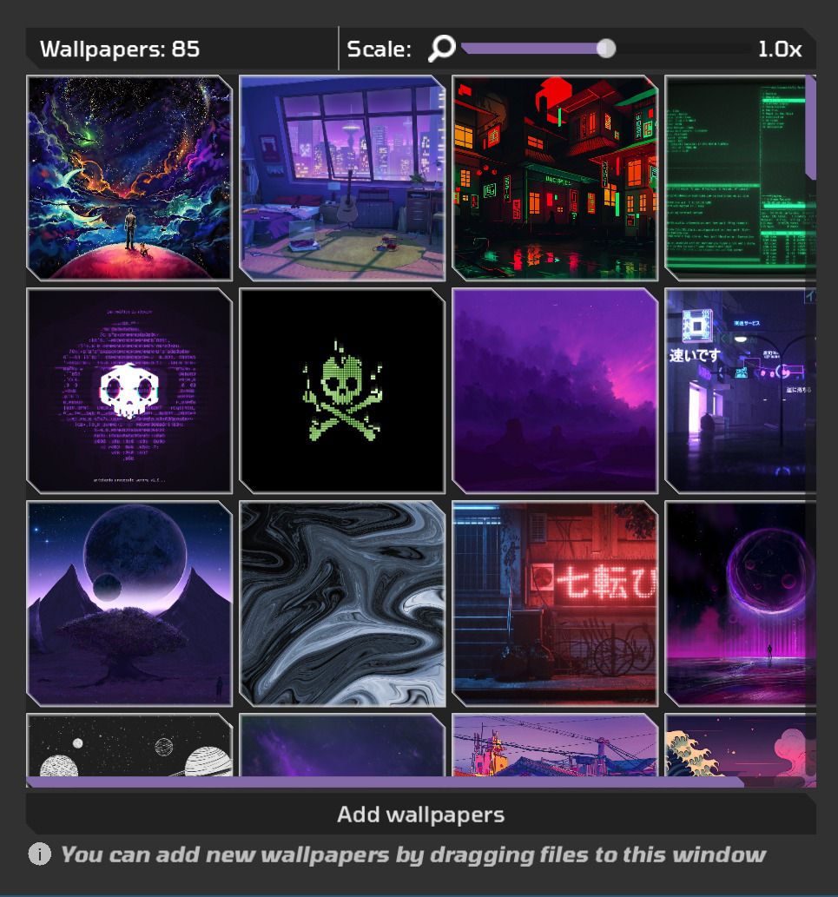
These stylized squares are what I call *Thumbnails* (*and they're the inspiration for the app logo*). There's an entry in the **Settings windows** where
you can change their **downscale factor**, that is, the **fraction of the original resolution that they'll have** represented as a **percentage**.

There's another element that benefits from this *downscale and caching* system to alleviate load times when **previewing images**. This section of the UI
occupies the other half of the screen in the main UI:
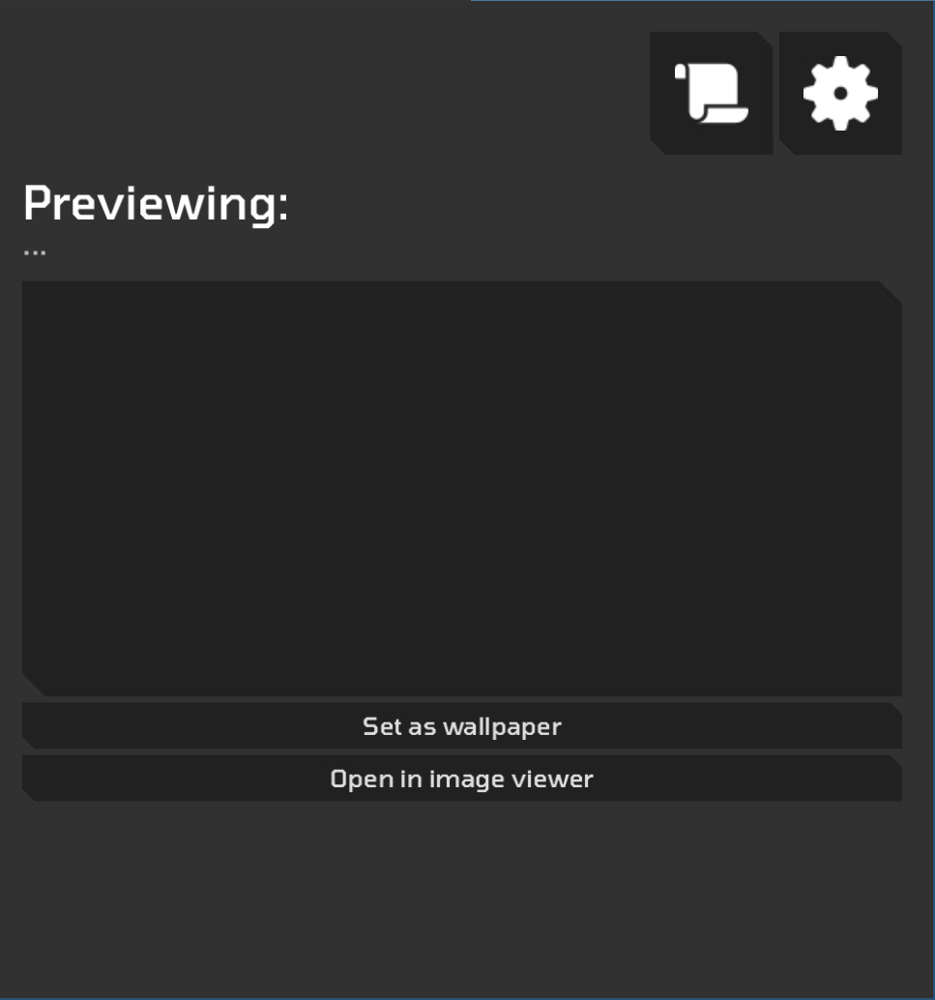
As you can see, this part of the UI shows the user preview of the selected wallpaper in a **smaller resolution**, but with the **same aspect ratio**.
**By default, preview images are not enabled**. Nonetheless, if you have wallpapers with **large resolutions**, you might notice a bit of lag when loading
them into the preview rect. Since the preview rect is quite small in comparison with normal wallpaper resolutions (*`480x270`, 1/4 of 1080p*), you can
render downscaled versions of your wallpapers with **half the resolution** for example and get **faster load** times **without noticable quality loss**.

> [!NOTE]
> More info about **downscaling** is provided inside the program in the form of **tooltips** which you can check by hovering your mouse over the name
> of the setting entry you want to get more info about (*in this case **Downscale factor** for **Thumbnails** and **Preview Images**)

### Adding new wallpapers
Once you've setup your initial configuration, it's time to use the app! If you have chosen the **default system folder** to save your wallpapers or
have assigned a fresh new folder, you can start importing wallpapers into the app in two different ways:
1. Either by clicking on the **Add wallpapers** button or,
2. **Dragging the file** you want to import into the **app window** (*As the tooltip on the bottom left suggests*).

If you choose to add your wallpapers using the **Add wallpapers** button, a **File Explorer window** will popup for you to navigate the system. Select
as many files as your heart desires and the app will load them into the **Import window**:
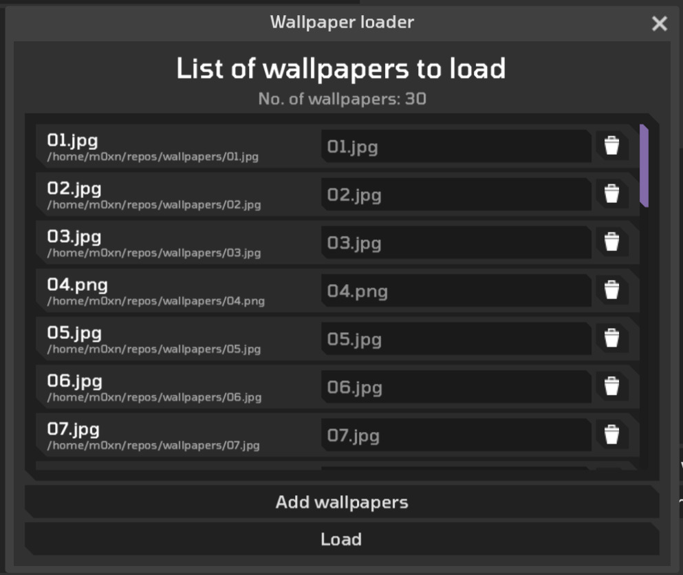
Here, you'll be presented with a list of all the **valid files** (*i.e. those with a **valid format** regardless of their **extension***) that you
imported, either if you chose to import them via the **file explorer** or via **file dragging**. Each entry in this list has **4 main elements**:
1. A filename label,
2. A (full) path label,
3. A name change text field (*if you want to change the name of the file*)
4. A trash  button to delete that entry.
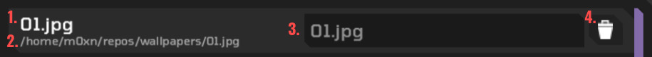

You can then choose to **add more wallpapers** (*using the same two methods from before*) or **load** them into the app. Loading the listed wallpapers
into the app will start the **rendering process** for the downscaled versions that will be used as [**thumbnails**](#what-are-thumbnails-and-preview-images)
by the app.

> [!NOTE]
> If **Process Preview Images** is enabled, the program will render two image files for each image you import into the program: the downscaled version 
> for its *thumbnail* and the downscaled version for its *preview image*, so, take in account that the **rendering process will take longer**.

### Interacting with the selected wallpaper
Once the file has been loaded into the **preview rect**, we have two possible options:
1. Setting the image as the system wallpaper
2. Opening the image in an image viewer

The most important step in the wallpaper managing process is the **most simple as well**. Since the button just **wraps a system command** to change the
current wallpaper, once you've selected one of your loaded wallpapers, making it your new wallpaper is a simple as pressing the **Set as wallpaper** button.
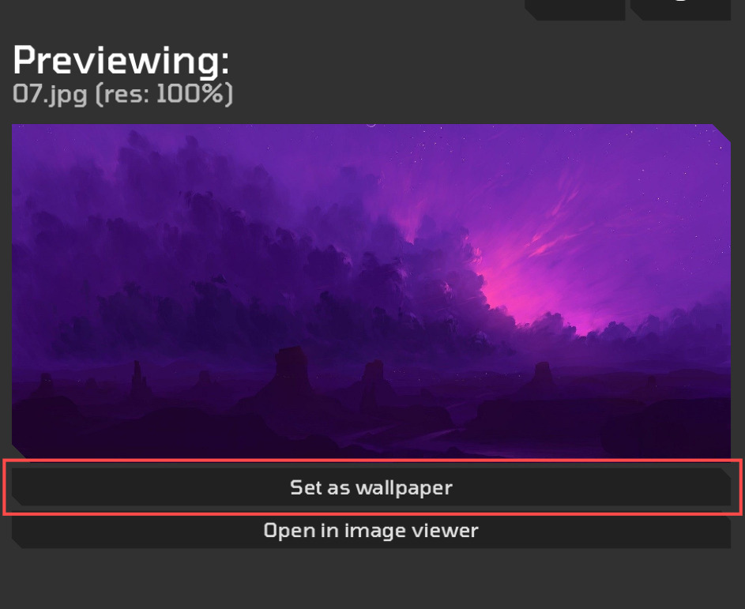
However, if you are not satisfied with the preview version that the app provides, you can always open the selected image (*in its full resolution version*) 
in a proper **image viewer** of your choice.


### Other minor features of the app
All the previous steps cover the most basic **user usage** of the app, but since I planned to make this app **multiplatform**, I've implemented a **settings
section** which you can check clicking on the  button.
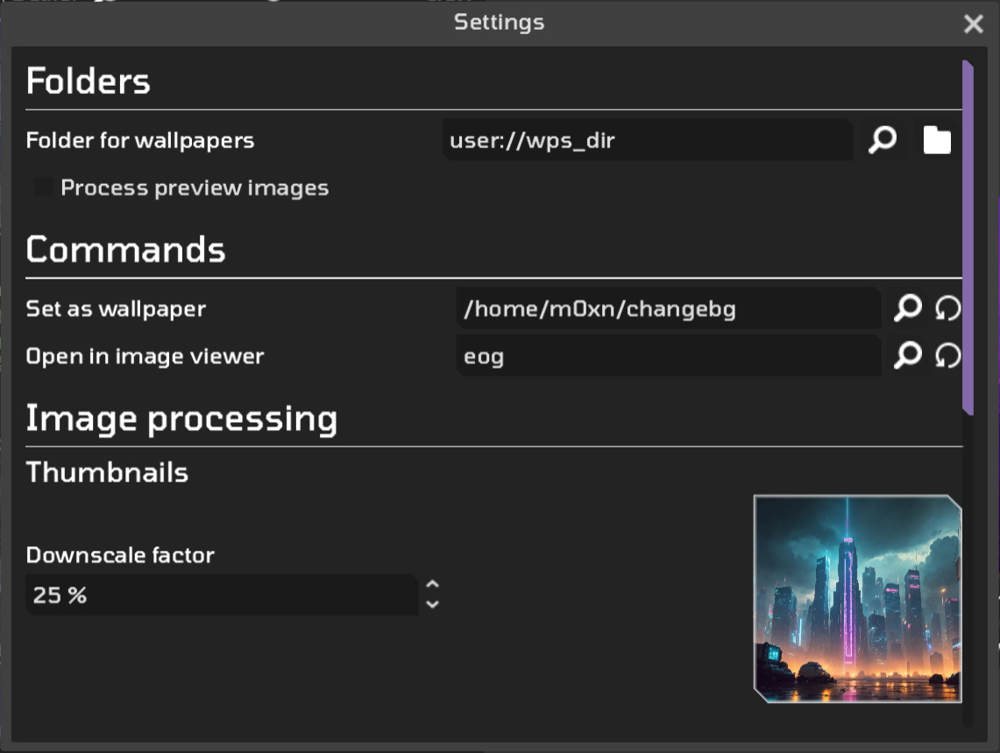
As I've already said in a note over the [*What are Thumbnails and Preview Images?*](#what-are-thumbnails-and-preview-images) section, I've implemented some
**tooltips** (*extra info about each setting*) which you can access through hovering your mouse over the **name** of the setting you want to get more info about
to gather some insight or personal recommendations on that specific entry.
You can also change:
- **Language** (*english or spanish*),
- **Accent color**, which tints some elements of the UI with the **hue** of the selected color
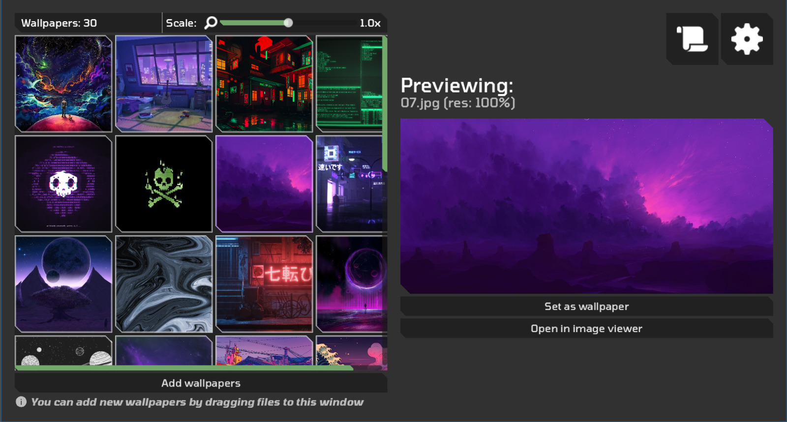,
- **Thumbnail scale step**, which I'll explain now along with the **Thumbnail's initial scale**,
- **Enable hint to drag and drop images to the app**, which toggles the hint that pops up at the **bottom left** corner of the app.

As introduced in the above list, there's a **scale slider** to change the scale of the **thumbnails** (*the base scale is `150x150`, so anything **below** `1.0`
will be **smaller** and everything **above** `1.0` will be **bigger***). In settings, you can change the **initial scale** (*Thumbnail's initial scale*) which
gets applied **only** at startup and you can change the **increment** or **decrement** that the slider will experience (*Thumbnail scale step*).

> [!IMPORTANT]
> I've also implemented **keybindings** for **reescaling thumbnails**: you can use `Control`+`Mouse Wheel` to **upscale** (*going up*) or **downscale** (*going down*)
> thumbnails or you can use the `+` and `-` signs along with the `Control` key to get the same result, respectively.

Finally, since it is called a **wallpaper manager** app, I've also added a feature to **delete** currently loaded wallpapers. This can be done by **right
clicking** the **thumbnail** of the wallpaper you want to delete. Don't worry, the program won't destroy it right away, but instead will prompt you with a
**confirmation message** to delete it. I know that I might need to make it more obvious, but for now, to delete wallpapers: ***RTFM*** (*or in this case the 
README file*).

## Reporting issues
I've implemented a feature that might come in handy for reporting errors in the program, which is a simple **Logs system**. You can access app logs by
clicking on the 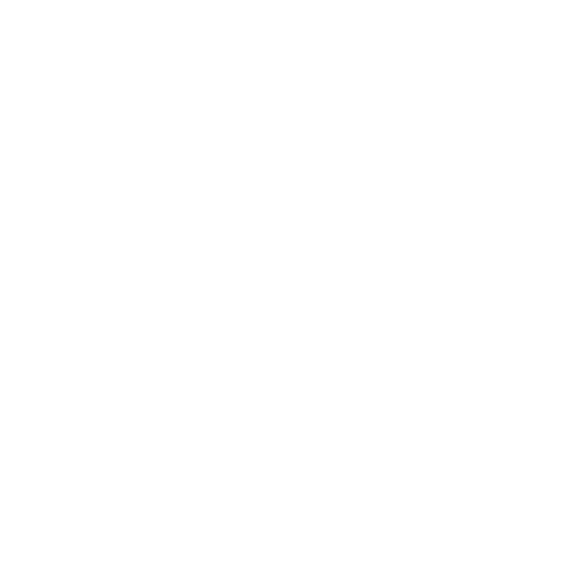 button. The following window will popup:
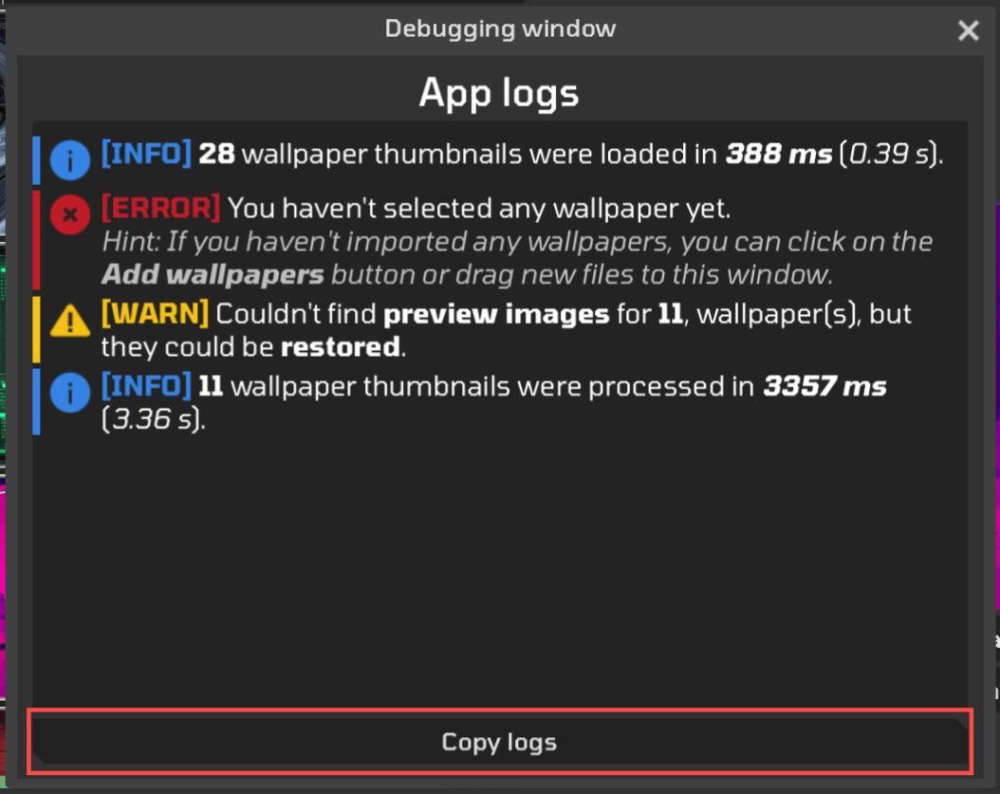
Here, you'll see all **info**, **warning** and **error** messages thrown by the **debug system** in the app. Clicking on the **Copy logs** buttons will
copy the contents of the debug window in a **plain format** and will prompt you to go to GitHub in order to report an **issue** or **bug** you might have
found while using the app. Accepting to go to GitHub will redirect you to the **Issues page** of this GitHub repository:
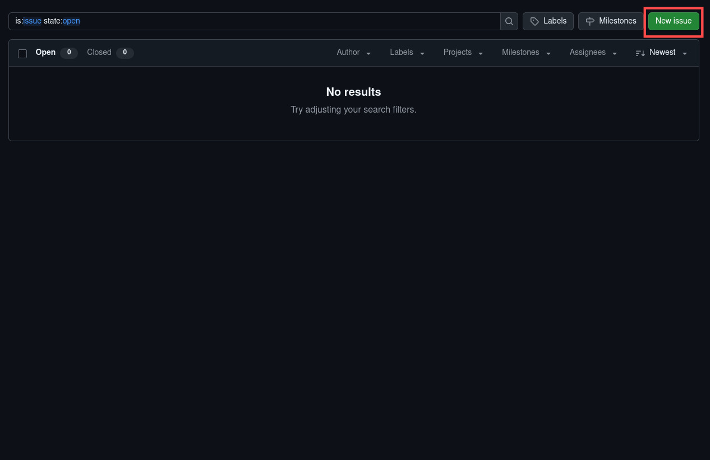
Clicking on the **New issue** button will show **3 options** to create a new issue (*you can report a bug using a template in Spanish or English, either way
someone or myself will be able to help with that particular issue*), select whichever template fits with you and write the requested info to report it.
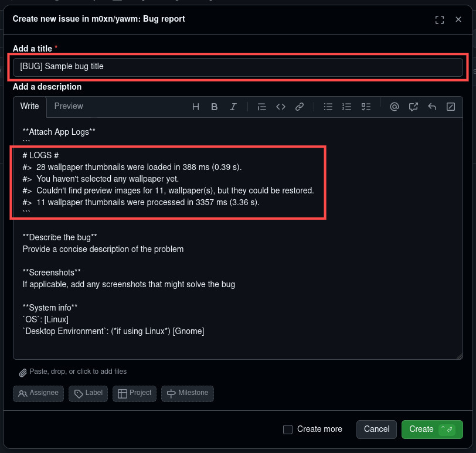
Just add a title alongside the `[BUG]` label indicator and **paste the logs** that the app copied to your clipboard previously into the **Attach App Logs**
section. Finally, click on the **Create** button and the report will be saved into the repository.

Hurray! You've just reported your first issue for this app.

## Contributing
I assume that if you want to contribute to the project you're already an experienced enough developer to know how to make a **pull request**, but no shame for
you anyways, if you don't know how to do it here are a couple of articles from the GitHub documentation that will teach you how to do a **pull request**:
[\[1\]](https://docs.github.com/en/pull-requests/collaborating-with-pull-requests/proposing-changes-to-your-work-with-pull-requests/creating-a-pull-request?platform=windows&tool=desktop),
[\[2\]](https://docs.github.com/en/pull-requests/collaborating-with-pull-requests/proposing-changes-to-your-work-with-pull-requests/creating-a-pull-request-from-a-fork).

In any case, the basic steps to follow are:
1. Create a fork of the project
2. Change the current working branch to `experimental` (*that way the new feature can be properly tested before being merged with `main`*)
3. Submit your pull request!

I have no strict rules or specific template for submitting a pull request, just include what makes sense to include: info about the features you want to include and
any kind of information that might help understand your proposal (*alongside some screenshots if you want to showcase that feature in a more visual way*). I'll then
take a look at your request and make any changes if necessary to integrate it into the project.

## Final thoughts
Just so I have some starting point for myself, or maybe for others to remake this app, I want to write some of the things that I thought they'd be cool to implement
but I don't want to do so right now because I'm happy with the result at the moment (*and tired*).
Here's a list of the things that I can recall (*I might update it if I come up with anything interesting later on*):

- Making the loading algorithm much faster by using Godot `Threads` implementation or event trying to talk to the GPU for that matter to increase the rendering speed
even more (*I don't know much about graphics programming but I suppose that **compute shaders** could be a way to do this*).
- Making a **better logging system** that can integrate with Engine logs and save reports on crash.
- Making a better integration of the startup settings with the main loop of the app (*I had to implement multiple guard clauses to avoid some processes from running
the first time you boot up the app*).
- Making a better implementation of *preview image* rendering (*right now, you can't re-render your preview images because of the way I implemented it*)
- Adding support for **multiple wallpaper** folders and maybe some sort of option to change between those folders within the main UI (*this would need a much better
infrastructure from the start and probably some of that work offload to the GPU*)
- Adding support for **animated wallpapers** which I'm guessing it would require me to tinker with some shader stuff, so GPU implementation would be crucial for this
one.
- Adding support for more languages than Spanish and English (*that would come at the cost of revisiting all the UI and making changes to the format of the translation
tables to allow for a more complex behavior and fonts with special characters*).

For now, those are the things that I think would make the program better. As I've said, I'm ok with how it turned out, but I'd surely rebuild the entire thing again if
I wanted to implement any of the things I've listed before.

That's it, I hope that you could find anything you needed in this README and that this little tool I've made for me, also works for you ;-).
